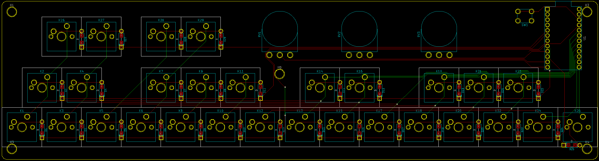

# The Keyboard Keyboard

A mechanical keyboard with a piano-esque layout, or a MIDI keyboard with MX style switches and (hopefully) QMK firmware?
This is a keyboard design for the very tiny segment of people who think the "computer keyboard as MIDI input" in Ableton is neat, and want more of the same.

PCB design is currently ready for prototyping and hopefully writing firmware, and a basic 3D printed case design will also be added to this repository at some point.
Design files and images will be added as they're ready!

## Firmware
I have been able to make a working firmware with remappable MIDI CC knobs, remappable mod keys, a velocity knob and octave controls.
Analog control of velocity is not currently supported in QMK because of the way it handles velocity in the underlying processing, which I have tried to address with [this pull request](https://github.com/qmk/qmk_firmware/pull/9940). If my changes are merged I will be able to provide firmware through the normal QMK repo, if not I will link my own fork here.

## Images

